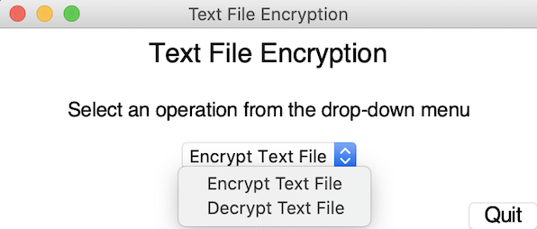

## Text File Encryption

Created a GUI program using Python that encrypts text files with multiple encryption layers and can decrypt them

Text is encrypted using a Vigenere Cipher, Affine Cipher and substitution 

## Screenshots

 
 
## Installation
To install and run, clone the repository, navigate to the cloned repository and run the following commands:
  ```bash
    pip install -r requirements.txt 
   ```
  ```bash
    python text_encryption.py
   ```

## Usage
##### To Encrypt a text file
1. From drop-down menu select 'Encrypt Text File'
2. In the prompt asking for a file, select the file you wish to encrypt 
3. Enter a key (This key will be used in the Vigenere Cipher)
4. Click "Encrypt"

The program will then encrypt the inputted text file and write the result to a new text file called "encrypted.txt".
It will also create another file called "encryption_keys.txt" and write both the cipher alphabet that was used for substitution and the Vigenere Key to this file. 
This file is needed to decrypt the text file you just encrypted as the program uses symmetric-key algorithms

##### To Decrypt a text file
1. From drop-down menu select 'Decrypt Text File'
2. In the prompt asking for your encrypted file, select the file you wish to decrypt 
2. In the prompt asking for the file containing the encryption keys, select the "encryption_keys.txt" that was generated with the text file you first encrypted
4. Click "Decrypt"

The program will then decrypt the encryted file you selected using the file "encryption_keys.txt" and the decrypted results will be written to a new text file called "decrypted.txt".

The repository contains example files that would be generated from running the program 

## References and Acknowledgment
[1] [Cryptography with Python](https://www.tutorialspoint.com/cryptography_with_python/index.htm) <br>
[2] [Vigenère Cipher](https://www.geeksforgeeks.org/vigenere-cipher/) <br>
[3] [Affine Cipher](http://practicalcryptography.com/ciphers/affine-cipher/) <br>
[4] [Substitution Cipher](https://www.geeksforgeeks.org/substitution-cipher/?ref=lbp) <br>
[5] [Difference between Monoalphabetic Cipher and Polyalphabetic Cipher](https://www.geeksforgeeks.org/difference-between-monoalphabetic-cipher-and-polyalphabetic-cipher/?ref=rp) <br>
[6] [Difference Between Symmetric and Asymmetric Key Encryption](https://www.geeksforgeeks.org/difference-between-symmetric-and-asymmetric-key-encryption/) <br>
[7] [Python GUI Programming With Tkinter](https://realpython.com/python-gui-tkinter/) <br>
